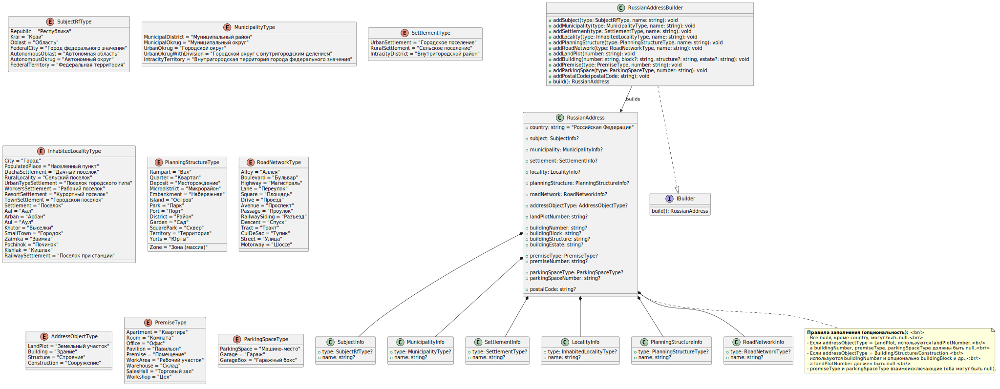

# RussianAddress

**Структура адреса:**
1. наименование страны (Российская Федерация);
2. наименование субъекта Российской Федерации;
3. наименование муниципального района, муниципального округа, городского округа или внутригородской территории (для городов федерального значения) в составе субъекта Российской Федерации, федеральной территории;
4. наименование городского или сельского поселения в составе муниципального района (для муниципального района) или внутригородского района городского округа (за исключением объектов адресации, расположенных на федеральных территориях);
5. наименование населенного пункта;
6. наименование элемента планировочной структуры;
7. наименование элемента улично-дорожной сети;
8. наименование объекта адресации «земельный участок» и номер земельного участка или тип и номер здания (строения), сооружения;
9. тип и номер помещения, расположенного в здании или сооружении, или наименование объекта адресации «машино-место» и номер машино-места в здании, сооружении

**Диаграмма классов:**

**Plantuml код диаграммы классов:**

```plantuml
@startuml

' ========== ENUMS (PascalCase, русские значения) ==========

enum SubjectRfType {
    Republic = "Республика"
    Krai = "Край"
    Oblast = "Область"
    FederalCity = "Город федерального значения"
    AutonomousOblast = "Автономная область"
    AutonomousOkrug = "Автономный округ"
    FederalTerritory = "Федеральная территория"
}

enum MunicipalityType {
    MunicipalDistrict = "Муниципальный район"
    MunicipalOkrug = "Муниципальный округ"
    UrbanOkrug = "Городской округ"
    UrbanOkrugWithDivision = "Городской округ с внутригородским делением"
    IntracityTerritory = "Внутригородская территория города федерального значения"
}

enum SettlementType {
    UrbanSettlement = "Городское поселение"
    RuralSettlement = "Сельское поселение"
    IntracityDistrict = "Внутригородской район"
}

enum InhabitedLocalityType {
    City = "Город"
    PopulatedPlace = "Населенный пункт"
    DachaSettlement = "Дачный поселок"
    RuralLocality = "Сельский поселок"
    UrbanTypeSettlement = "Поселок городского типа"
    WorkersSettlement = "Рабочий поселок"
    ResortSettlement = "Курортный поселок"
    TownSettlement = "Городской поселок"
    Settlement = "Поселок"
    Aal = "Аал"
    Arban = "Арбан"
    Aul = "Аул"
    Khutor = "Выселки"
    SmallTown = "Городок"
    Zaimka = "Заимка"
    Pochinok = "Починок"
    Kishlak = "Кишлак"
    RailwaySettlement = "Поселок при станции"
}

enum PlanningStructureType {
    Rampart = "Вал"
    Zone = "Зона (массив)"
    Quarter = "Квартал"
    Deposit = "Месторождение"
    Microdistrict = "Микрорайон"
    Embankment = "Набережная"
    Island = "Остров"
    Park = "Парк"
    Port = "Порт"
    District = "Район"
    Garden = "Сад"
    SquarePark = "Сквер"
    Territory = "Территория"
    Yurts = "Юрты"
}

enum RoadNetworkType {
    Alley = "Аллея"
    Boulevard = "Бульвар"
    Highway = "Магистраль"
    Lane = "Переулок"
    Square = "Площадь"
    Drive = "Проезд"
    Avenue = "Проспект"
    Passage = "Проулок"
    RailwaySiding = "Разъезд"
    Descent = "Спуск"
    Tract = "Тракт"
    CulDeSac = "Тупик"
    Street = "Улица"
    Motorway = "Шоссе"
}

enum AddressObjectType {
    LandPlot = "Земельный участок"
    Building = "Здание"
    Structure = "Строение"
    Construction = "Сооружение"
}

enum PremiseType {
    Apartment = "Квартира"
    Room = "Комната"
    Office = "Офис"
    Pavilion = "Павильон"
    Premise = "Помещение"
    WorkArea = "Рабочий участок"
    Warehouse = "Склад"
    SalesHall = "Торговый зал"
    Workshop = "Цех"
}

enum ParkingSpaceType {
    ParkingSpace = "Машино-место"
    Garage = "Гараж"
    GarageBox = "Гаражный бокс"
}

' ========== КЛАССЫ-КОНТЕЙНЕРЫ "ПАРА (ТИП, ИМЯ)" ==========
' Все поля внутри могут быть null (например, известен только тип, но не имя)
class SubjectInfo {
    + type: SubjectRfType?
    + name: string?
}

class MunicipalityInfo {
    + type: MunicipalityType?
    + name: string?
}

class SettlementInfo {
    + type: SettlementType?
    + name: string?
}

class LocalityInfo {
    + type: InhabitedLocalityType?
    + name: string?
}

class PlanningStructureInfo {
    + type: PlanningStructureType?
    + name: string?
}

class RoadNetworkInfo {
    + type: RoadNetworkType?
    + name: string?
}

' ========== ОСНОВНОЙ КЛАСС АДРЕСА ==========

class RussianAddress {
    ' а) Страна (всегда заполнена)
    + country: string = "Российская Федерация"
    
    ' б) Субъект РФ
    + subject: SubjectInfo?
    
    ' в) Муниципальное образование
    + municipality: MunicipalityInfo?
    
    ' г) Поселение или внутригородской район
    + settlement: SettlementInfo?
    
    ' д) Населенный пункт
    + locality: LocalityInfo?
    
    ' е) Элемент планировочной структуры
    + planningStructure: PlanningStructureInfo?
    
    ' ж) Элемент улично-дорожной сети
    + roadNetwork: RoadNetworkInfo?
    
    ' з) Объект адресации
    + addressObjectType: AddressObjectType?
    
    ' ---- Поля для земельного участка ----
    + landPlotNumber: string?
    
    ' ---- Поля для здания / строения / сооружения ----
    + buildingNumber: string?
    + buildingBlock: string?
    + buildingStructure: string?
    + buildingEstate: string?
    
    ' к) Помещение (внутри здания)
    + premiseType: PremiseType?
    + premiseNumber: string?
    
    ' к) Машино-место
    + parkingSpaceType: ParkingSpaceType?
    + parkingSpaceNumber: string?
    
    ' ---- Служебные поля (могут быть null до заполнения) ----
    + postalCode: string?
}

interface IBuilder
{
    build(): RussianAddress
}

class RussianAddressBuilder {
    + addSubject(type: SubjectRfType, name: string): void
    + addMunicipality(type: MunicipalityType, name: string): void
    + addSettlement(type: SettlementType, name: string): void
    + addLocality(type: InhabitedLocalityType, name: string): void
    + addPlanningStructure(type: PlanningStructureType, name: string): void
    + addRoadNetwork(type: RoadNetworkType, name: string): void
    + addLandPlot(number: string): void
    + addBuilding(number: string, block?: string, structure?: string, estate?: string): void
    + addPremise(type: PremiseType, number: string): void
    + addParkingSpace(type: ParkingSpaceType, number: string): void
    + addPostalCode(postalCode: string): void
    + build(): RussianAddress
}

' Композиция: RussianAddress владеет экземплярами Info-классов
RussianAddressBuilder ..|> IBuilder
RussianAddressBuilder --> RussianAddress : builds
RussianAddress *-- SubjectInfo
RussianAddress *-- MunicipalityInfo
RussianAddress *-- SettlementInfo
RussianAddress *-- LocalityInfo
RussianAddress *-- PlanningStructureInfo
RussianAddress *-- RoadNetworkInfo

note bottom of RussianAddress
  <b>Правила заполнения (опциональность):</b><br/>
  - Все поля, кроме country, могут быть null.<br/>
  - Если addressObjectType = LandPlot, используются landPlotNumber,<br/>
    а buildingNumber, premiseType, parkingSpaceType должны быть null.<br/>
  - Если addressObjectType = Building/Structure/Construction,<br/>
    используются buildingNumber и опционально buildingBlock и др.,<br/>
    а landPlotNumber должен быть null.<br/>
  - premiseType и parkingSpaceType взаимоисключающие (оба могут быть null).
end note

@enduml
```

